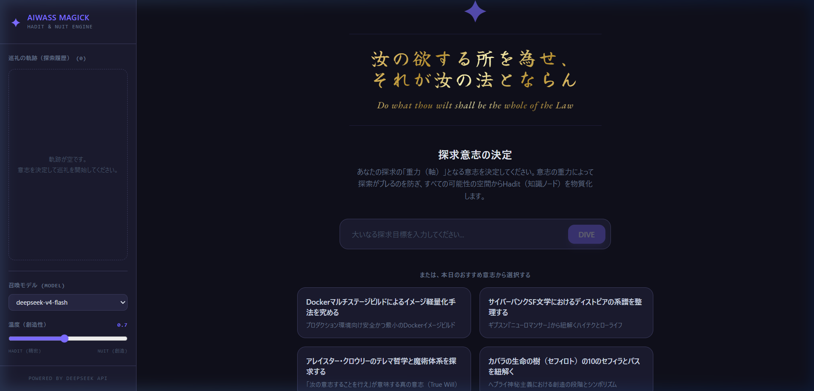
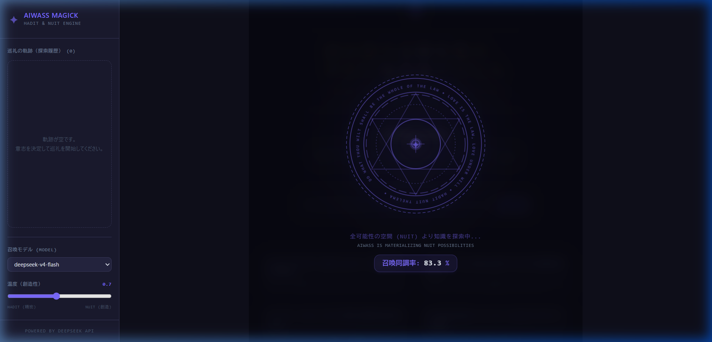
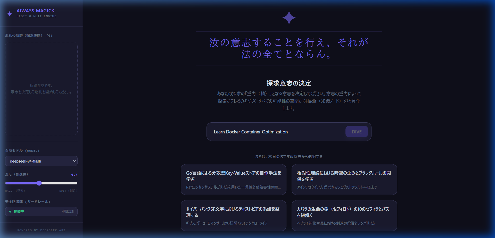

<p align="center">
  <strong style="font-size: 2em;">✦</strong>
</p>

<h1 align="center">Aiwass Magick</h1>

<p align="center">
  <em>「汝の欲する所を為せ、それが汝の法とならん」</em><br />
  <em>Do what thou wilt shall be the whole of the Law</em>
</p>

<p align="center">
  <a href="https://opensource.org/licenses/MIT"></a>
  
  
  
  
  
  
  
</p>

---

## 概要

**Aiwass Magick** は、LLM（DeepSeek API）を活用した **自律・動的な知識探索フレームワーク** です。

既存の学習ツールやRAGが提供する「AIが生成した静的なレポートを読むだけ」の退屈な体験を排し、**ユーザーの主体的意志（Will）に基づき、コンテキストの軸（重力）を維持したまま、知識の海を無限にダイブしていく知的興奮** をシステムとして再現・設計しています。

### ✦ Thelema Engine（コア体験）

| コンセプト | 説明 |
|:---|:---|
| **意志の重力 (Will Anchor)** | 「GCP ACE試験合格」などの最終目標を軸としてプロンプトに固定。探索の無限拡散（ブレ）を防ぎつつ、関連領域をサジェストします。 |
| **魔術的インターフェース (Magick UI)** | 用語チップ・関連トピックカードをクリックするだけで、全可能性の空間（Nuit）から知識ノード（Hadit）を動的に物質化（プロビジョニング）します。 |
| **自由意志ダイブ** | サジェストに縛られず、任意のキーワードを自由に入力して次のトピックへダイブできます。 |
| **日替わり意志サジェスト** | 日付をシードとした擬似乱数で、毎日異なる20種類の探求テーマから4つを提案します。 |
| **Agentic 自己修正ループ** | LLMが英語で応答した場合、自動的に日本語への再生成を最大2回リトライする自己修正エージェントを内蔵しています。 |

---

## スクリーンショット

<p align="center">
  <br />
  <em>意志決定画面 — 金箔風毛筆書体による格言と日替わりサジェスト</em>
</p>

<p align="center">
  <br />
  <em>魔方陣アニメーション — 知識ノード物質化中のローディング画面</em>
</p>

<p align="center">
  <br />
  <em>探索画面 — Markdown解説・文脈用語・関連トピックカード</em>
</p>

---

## 技術スタック

### バックエンド

| 技術 | 用途 |
|:---|:---|
| **Python 3.11+** | ランタイム |
| **FastAPI** | REST API フレームワーク |
| **OpenAI SDK** | DeepSeek API クライアント（OpenAI互換） |
| **Pydantic v2** | リクエスト/レスポンスのバリデーションとスキーマ定義 |
| **SlowAPI** | レートリミッター |
| **Uvicorn** | ASGI サーバー |

### フロントエンド

| 技術 | 用途 |
|:---|:---|
| **React 18** | UI ライブラリ |
| **Vite 5** | 開発サーバー・バンドラー |
| **TailwindCSS 3.4** | ユーティリティファースト CSS |
| **react-markdown** | Markdown レンダリング |
| **remark-gfm** | GitHub Flavored Markdown サポート |
| **rehype-highlight** | コードブロックのシンタックスハイライト |
| **highlight.js** | シンタックスハイライトエンジン |

### インフラ

| 技術 | 用途 |
|:---|:---|
| **Docker** | コンテナ化 |
| **Docker Compose** | マルチコンテナオーケストレーション |
| **Nginx** | フロントエンドの静的配信 & APIリバースプロキシ |

---

## プロジェクト構造

```
Aiwass-Magick/
├── .env.example              # 環境変数テンプレート
├── docker-compose.yml        # Docker Compose 定義
├── Aiwass-Magick_concept.md  # コンセプト設計書
├── LICENSE                   # MIT License
│
├── backend/
│   ├── Dockerfile
│   ├── requirements.txt
│   └── app/
│       ├── __init__.py
│       ├── config.py          # Pydantic Settings（環境変数管理）
│       ├── main.py            # FastAPI アプリケーションエントリポイント
│       └── routers/
│           ├── __init__.py
│           ├── dive.py        # /api/dive — 知識探索エンドポイント
│           ├── chat.py        # /api/chat — 汎用チャットエンドポイント
│           └── models.py      # /api/models — モデル一覧取得
│
├── frontend/
│   ├── Dockerfile
│   ├── nginx.conf             # Nginx リバースプロキシ設定
│   ├── package.json
│   ├── vite.config.js
│   ├── tailwind.config.js
│   ├── index.html
│   └── src/
│       ├── main.jsx           # React エントリポイント
│       ├── App.jsx            # ルートコンポーネント・状態管理
│       ├── index.css          # グローバルスタイル・カスタムフォント
│       └── components/
│           ├── MagickDeck.jsx # メインデッキ UI（意志決定・探索・ローダー）
│           └── Sidebar.jsx    # サイドバー（履歴・モデル選択・温度調整）
│
└── docs/
    └── images/                # README 用スクリーンショット
```

---

## セットアップ

### 前提条件

- **DeepSeek API キー** — [DeepSeek Platform](https://platform.deepseek.com/) からAPIキーを取得してください
- ローカル開発: **Python 3.11+** / **Node.js 20+**
- Docker 起動: **Docker** & **Docker Compose**

### 1. リポジトリのクローン

```bash
git clone https://github.com/Tagomori0211/Aiwass-Magick.git
cd Aiwass-Magick
```

### 2. 環境変数の設定

```bash
cp .env.example .env
```

`.env` を編集し、DeepSeek API キーを設定します：

```env
DEEPSEEK_API_KEY=sk-xxxxxxxxxxxxxxxxxxxxxxxxxxxxxxxx
DEEPSEEK_BASE_URL=https://api.deepseek.com
DEFAULT_MODEL=deepseek-v4-flash
MAX_INPUT_LENGTH=10000
RATE_LIMIT_PER_MINUTE=20
CORS_ORIGINS=["http://localhost:3000","http://localhost:80","http://localhost:5173"]
```

---

### 🐳 Docker Compose で起動（推奨）

```bash
docker-compose up -d
```

ブラウザで **http://localhost:3000** にアクセスしてください。

> バックエンド: ポート `8000`（内部）  
> フロントエンド: ポート `3000`（Nginx 経由で公開）

---

### 🔧 ローカル開発で起動

#### バックエンド

```bash
cd backend
pip install -r requirements.txt
uvicorn app.main:app --host 127.0.0.1 --port 8000 --reload
```

#### フロントエンド

```bash
cd frontend
npm install
npm run dev
```

ブラウザで **http://localhost:5173** にアクセスしてください。

> Vite の開発プロキシにより `/api/*` リクエストは自動的に `http://localhost:8000` に転送されます。

---

## 使い方

### 1. 意志の決定

アプリケーションを開くと、**意志決定画面** が表示されます。

- テキストボックスに探求したい目標を自由に入力するか、**本日のおすすめ意志**（日替わり4件）から1つを選んで **DIVE** をクリックします。
- 入力した意志が「重力（軸）」となり、以降の探索はすべてこの意志に沿ってサジェストされます。

### 2. 知識の探索（ダイブ）

意志を決定すると、**魔方陣ローディングアニメーション** の後、知識ノードが物質化されます。

表示される情報：
- 📍 **パンくずリスト** — 現在の探索階層を可視化
- 📖 **解説パネル** — Markdown 形式のリッチな知識解説
- 🔤 **Hadit 概念（文脈用語）** — 解説内のキーワードをチップ表示、クリックで詳細展開
- 🧭 **巡礼の目的地（関連トピック）** — 次にダイブするトピック候補（2〜4件）

### 3. 自由意志ダイブ

解説パネルの下にある **「自由意志によるダイブ」** 入力フォームから、サジェストに縛られない任意のトピックを入力してダイブすることも可能です。

### 4. 探索履歴の巻き戻し

サイドバーの **巡礼の軌跡（探索履歴）** から、過去のノードをクリックするとその時点にタイムトラベルできます。

---

## API リファレンス

### `POST /api/dive`

知識探索（ダイブ）を実行します。

**リクエストボディ:**

```json
{
  "will": "GCP ACE試験に合格する",
  "current_topic": "VPC",
  "history": ["GCP基礎", "ネットワーク"],
  "model": "deepseek-v4-flash",
  "temperature": 0.7
}
```

**レスポンス:**

```json
{
  "breadcrumb": ["GCP基礎", "ネットワーク", "VPC"],
  "explanation": "## VPC（Virtual Private Cloud）\nVPCはプロジェクト単位の...",
  "term_suggestions": [
    { "term": "CIDR", "hint": "IPアドレス範囲をスラッシュ表記で表す方法" }
  ],
  "related_topics": [
    { "topic": "Cloud NAT", "reason": "外部IPを持たないインスタンスの安全な通信に必要" }
  ],
  "magick_metadata": {
    "current_will_vector": "gcp_ace_network_focus"
  }
}
```

### `POST /api/chat`

汎用チャット（ストリーミング対応）を実行します。

### `GET /api/models`

利用可能なモデル一覧を取得します。

### `GET /health`

ヘルスチェック。`{"status": "ok"}` を返します。

---

## 環境変数

| 変数名 | 説明 | デフォルト |
|:---|:---|:---|
| `DEEPSEEK_API_KEY` | DeepSeek API キー（**必須**） | — |
| `DEEPSEEK_BASE_URL` | DeepSeek API ベース URL | `https://api.deepseek.com` |
| `DEFAULT_MODEL` | デフォルトで使用するモデル | `deepseek-v4-flash` |
| `MAX_INPUT_LENGTH` | 入力文字数の上限 | `10000` |
| `RATE_LIMIT_PER_MINUTE` | API レートリミット（回/分） | `20` |
| `CORS_ORIGINS` | 許可するオリジン（JSON 配列） | `["http://localhost:3000","http://localhost:80"]` |

---

## デザインシステム

| トークン | カラーコード | 用途 |
|:---|:---|:---|
| `night-950` | `#07070f` | 最深背景 |
| `night-900` | `#0f0f1a` | メイン背景 |
| `night-800` | `#1a1a2e` | カード・パネル背景 |
| `night-700` | `#252540` | ホバー背景 |
| `violet-accent` | `#7c6bff` | アクセントカラー |
| `violet-hover` | `#6a59f0` | ホバー時アクセント |
| Gold Metallic | 金箔グラデーション | 格言テキスト |

**フォント:**
- 毛筆書体: **Yuji Syuku** / **Yuji Mai**（Google Fonts）
- セリフ書体: **EB Garamond**（Google Fonts）
- 本文: システムフォント `sans-serif`
- コード: `JetBrains Mono`, `Fira Code`, `Consolas`

---

## ライセンス

[MIT License](LICENSE) © 2026 田籠 (Tagomori0211)

---

<p align="center">
  <strong>✦</strong><br />
  <em>Love is the law, love under will.</em>
</p>
